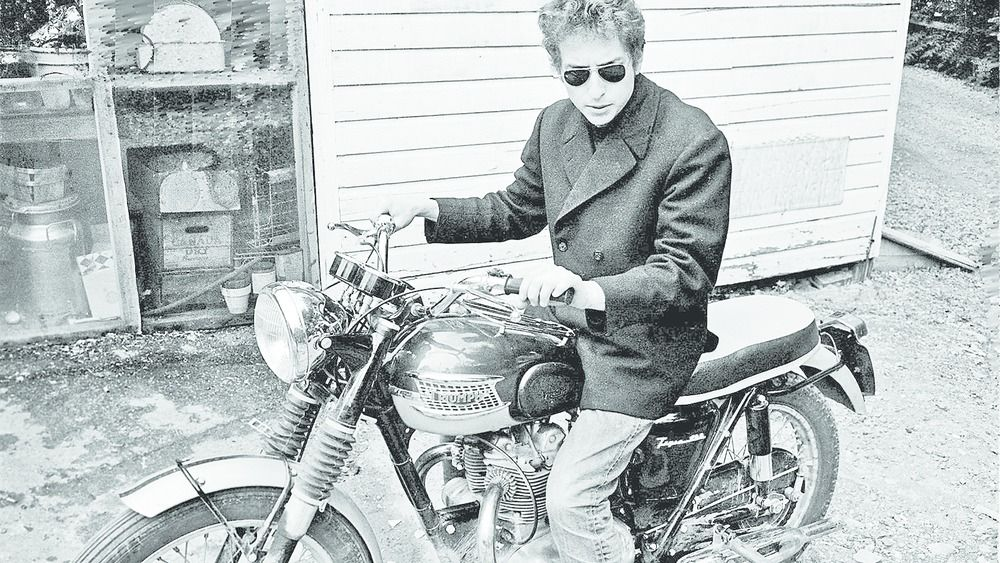
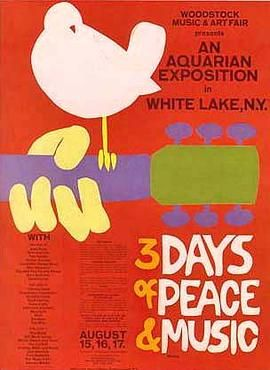

Aquí la explicación completa de American Pie, de Don McLean. En 1959, tres de los músicos más populares mueren en un accidente de avión... también perdonen el comentario cachasiento acerca de Bob Dylan y Calamaro. Para cojudeces.com, Dylan es lo mejor que Estados Unidos ha dado a luz por siempre.

Aquí les va la explicación de un tema diseminado en 1971 y cuya melodía, estamos seguros, la tararean con el mismo placer tipos como Bruce Springsteen, Silvio Rodríguez y [Ulises Lima](https://es.wikipedia.org/wiki/Los_detectives_salvajes).

La canción es American Pie, escrita por Don McLean, con un cover muy famoso y un [buen videoclip interpretado por Madonna](https://youtu.be/X4RDB-mMDJg) allá por los años que ya no recordamos.

## American Pie

> **A long, long time ago… I can still remember**  
> **How that music used to make me smile**  
> **And I knew if I had my chance**  
> **That I could make those people dance**  
> **And maybe they’d be happy for a while**

El tema fue publicado en 1971, y bueno, hace referencia al año 1959. Eran los inicios del rock n’ roll y todos los adolescentes soñaban tocar en una banda. Hoy tenemos PlayStation, Youtube, y Tik Tok manteniendo ocupados y productivos a nuestras futuras generaciones.

> **But February made me shiver**  
> **With every paper I’d deliver**  
> **Bad news on the doorstep**  
> **I couldn’t take one more step**

El 3 de Febrero de 1959 (tenía que ser el TRES, obviamente), TRES de los músicos más populares del momento murieron en un accidente de avión. [Buddy Holly](http://en.wikipedia.org/wiki/Buddy_Holly), [Ritchie Valens](http://en.wikipedia.org/wiki/Ritchie_Valens) (La Bamba), y [JP Richardson](http://en.wikipedia.org/wiki/The_Big_Bopper) (The Big Bopper).

#### THE YORK DISPATCH, Pennsylvania, Feb. 3, 1959

> **I can’t remember if I cried**  
> **When I read about his widowed bride**  
> **But something touched me deep inside**  
> **The day the music died**

Buddy Holly tenía pocos meses de casado al momento del accidente. Su esposa estaba embarazada pero perdió al bebe poco tiempo después de la tragedia. El 3 de Febrero de 1959 se conoce como [The Day the Music Died](http://en.wikipedia.org/wiki/The_Day_the_Music_Died).

> **So bye-bye Miss American Pie**  
> **Drove my chevy to the levee**  
> **But the levee was dry**  
> **And them good ole boys were drinkin’ whiskey and rye**  
> **Singing “This’ll be the day that I die**  
> **This’ll be the day that I die”**

Uno de los hits de Buddy Holly: “That’ll be the day”, uno de los versos de la canción dice “that’ll be the day that I die”. Algo así como los Enanitos Verdes cantando “te acordás del Flaco Spinetta, cuando cantaba…”. Y naturalmente tiene que ser un Chevy, producido por General Motors…

> **Did you write the book of love**  
> **And do you have faith in God above**  
> **If the Bible tells you so**

The [Book of Love](http://www.youtube.com/watch?v=BVvHEjJ62T0&), hit de [The Monotones](http://en.wikipedia.org/wiki/The_Monotones?ref=cojudeces-com.ghost.io), 1958. Otro tema de los años 50: _If the Bible Tells Me So_. O también una canción de lavado cerebral escolar: “[Jesus loves me this I know, for the Bible tells me so](https://youtu.be/o12C8fWzER0)”.

> **Now do you believe in Rock n’ Roll**  
> **Can music save your mortal soul?**  
> **And can you teach me how to dance real slow?**

Hit de 1965: [Do You Believe in Magic](https://youtu.be/JnbfuAcCqpY), versos: “do you believe in magic… it’s like trying to tell a stranger ‘bout rock n’ roll”.

Bailar lento era popular durante los eventos rockeros antes de que llegaran tipos como [Syd Barrett](http://en.wikipedia.org/wiki/Syd_Barrett) con láminas de LSD y llevaran el rock a otra dimensión.

> **Well I know that you’re in love with him**  
> **‘cause I saw you dancing in the gym**  
> **You both kicked off your shoes**  
> **Man, I dig those rhythm and blues!**

Bailando en el “gym”, es decir sobre la cancha de basket. Hay que quitarse los zapatos para no malograr el parket. El rhythm and blues expande sus límites a mitad de los ’50. Emerge de la comunidad negra, se vuelve popular entre los blancos.

> **I was a lonely teenage broncin’ buck**  
> **With a pink carnation and a pickup truck**  
> **But I knew I was out of luck**  
> **The day the music died**

Broncin’ buck, caballo salvaje, imagínenlo en un rodeo, en Texas. La camioneta pick-up encaja perfectamente. Si aún tienes el pink carnation, entonces estás solano joyas porque supuestamente la flor es para tu chica. También hubo un hit en 1957 titulado [A White Sport Coat (and a Pink Carnation)](http://www.youtube.com/watch?v=zD8MnvyAi6I&).

> **I started singing**  
> **Bye-bye Miss American Pie…**  
  
> **Now for ten years we’ve been on our own**  
> **And moss grows fat on a rolling stone**  
> **But that’s not how it used to be**

Diez años han pasado, finales de los ’60 entonces… las siguientes líneas qué caraxo significarán. Se referira a que el flojonazo de Dylan no hizo tours desde 1966 hasta 1974 (de ahí _grows fat_?)… o simplemente a los cambios en el rock en la década de los 60s cuando las bandas empiezan a ganar mucho más villegas (billete... _grows fat_).

> **When the jester sang for the King and Queen**  
> **In a coat he borrowed from James Dean**  
> **And a voice that came from you and me**

El _jester_ (bufón) es Bob Dylan (Bob Dylan es básicamente una copia agringada y barata de Andrés Calamaro, no? 😁), quien cantó en un evento en Washington DC cuyo principal invitado fue Martin Luther King Jr. Los Kennedys (rey y reina de Camelot) estaban presentes.

En la peli [Rebelde Sin Causa](http://en.wikipedia.org/wiki/Rebel_Without_a_Cause), James Dean usa una casaca roja (que simboliza el momento de entrar en acción). En la portada de The Freewheelin’ Bob Dylan, el famoso _jester_ aparece usando la casaca roja de James Dean.

#### El grande y Suze Rotolo en el cover de The Freewheelin' Bob Dylan

La voz de las masas, tú voz y la mía. Lo que tanto queríamos expresar, Dylan lo cantaba con precisión y poesía. _A voice that came from you and me_.

> Nota el margen: By the way, perdonen nuestro comentario cachasiento acerca de Bob Dylan y Calamaro. Para cojudeces.com, Dylan es el mejor cantautor que Estados Unidos ha dado a luz por siempre.

> **Oh, and while the king was looking down**  
> **The jester stole his thorny crown**  
> **The courtroom was adjourned**  
> **No verdict was returned**

Good-bye Elvis, hello Dylan… y no hubo veredicto en lo del asesinato de JFK, ya que el “asesino” estaba ya muerto. [Lee Harvey Oswald](http://en.wikipedia.org/wiki/Lee_Harvey_Oswald).

> **And while Lennon read a book of Marx**  
> **The quartet practiced in the park**  
> **And we sang dirges in the dark**  
> **The day the music died**

Introducción de temas políticos en canciones de “el cuarteto”, The Beatles (e.g., Revolution). Dirges in the dark, funeral de JFK?

> **We were singing**  
> **Bye-bye Miss American Pie…**

> **Helter Skelter in a summer swelter**  
> **The birds flew off with a fallout shelter**  
> **Eight miles high and falling fast**  
> **It landed foul on the grass**  
> **The players tried for a forward pass**  
> **With the jester on the sidelines in a cast**

Los famosos asesinatos organizados por Charles Manson ocurrieron en el verano de 1969. El HDP luego dijo que la canción [Helter Skelter](https://youtu.be/vWW2SzoAXMo) de The Beatles lo inspiró. [The Byrds](http://en.wikipedia.org/wiki/The_Byrds) ascendían a la fama, canción: Eight Miles High. Letra de Helter Skelter: “I’m coming down fast but I’m miles above you”.

Jester on the sidelines: Bob Dylan se accidentó en su motocicleta el 29 de julio de 1966 y pasó nueve meses alejado del mundo.

> **Now the half-time air was sweet perfume**  
> **While the sergeants played a marching tune**  
> **We all got up to dance**  
> **Oh, but we never got the chance!**  
> **‘Cause the players tried to take the field**  
> **The marching band refused to yield**  
> **Do you recall what was revealed**  
> **The day the music died?**

Definitivamente Sgt. Pepper’s Lonely Hearts Club Band. _The marching band refused to yield_: A pesar de la avalancha de nuevas bandas de rock, The Beatles siguieron siendo The Beatles y dominaron indiscutiblemente los años 60.

> **We started singing**  
> **Bye-bye Miss American Pie…**

> **And there we were all in one place**  
> **A generation lost in space**  
> **With no time left to start again**

Todos en un mismo lugar: Woodstock. La generación perdida: hippies.

#### poster de Woodstock

> **So come on, Jack be nimble, Jack be quick**  
> **Jack flash sat on a candlestick**  
> **Cause fire is the devil’s only friend**

Jack Be Nimble es una famosa canción de cuna, y también Jack está en un tema de los Rolling Stones: Jumpin’ Jack Flash. También hay alusión a la heroína (dicen que el término en jerga es Jack Flash y, bueno, se necesita una vela para diluirla).

> **Oh and as I watched him on the stage**  
> **My hands were clenched in fists of rage**  
> **No angel born in hell**  
> **Could break that satan’s spell**  
> **And as the flames climbed high into the night**  
> **To light the sacrificial rite**  
> **I saw satan laughing with delight**  
> **The day the music died**

En 1968, Altamont Speedway, los Rolling contrataron a miembros de [Hell’s Angels](http://www.morethings.com/music/rolling_stones/images/hells_angels/hells_angels-12-6-1969-altamont027airplane.jpg) para que se encargaran de la seguridad del concierto. **Contratar criminales como tu equipo de seguridad no es necesariamente buena idea**. Los Hell’s Angels asesinaron a un fan a golpes y puñaladas. Luego se empezó a decir cojudeces del tipo “el tema Sympathy for the Devil encendió la violencia de los Hell’s Angels” y los Rolling dejaron de tocar ese tema en vivo por los próximos seis años.

Satanás riendo. Quién más que Mick Jagger.

> **He was singing**  
> **Bye-bye Miss American Pie…**

> **I met a girl who sang the blues**  
> **And I asked her for some happy news**  
> **But she just smiled and turned away**

Janis Joplin sang the blues... y se nos fue demasiado pronto a los 27 años.

> **I went down to the sacred store**  
> **Where I’d heard the music years before**  
> **But the man there said the music wouldn’t play**

Los discos de Buddy Holly eran producidos en formato 78 RPM (revoluciones por minuto). A finales de los años 60 el formato 78 RPM ya no existía, fue reemplazado por el de 45 RPM. Los discos de Buddy Holly, entonces, _wouldn’t play_.

> **And in the streets the children screamed**  
> **The lovers cried and the poets dreamed**  
> **But not a word was spoken**  
> **The church bells all were broken**  
> **And the three men I admire the most**  
> **The father, son, and the holy ghost**  
> **They caught the last train for the coast**  
> **The day the music died**

Los Flower Children atacados por la policía durante las protestas en Berkeley en 1969. El padre, el hijo, y el espíritu santo, ustedes escojan: Buddy Holly, Ritchie Valens, Big Bopper, o Janis, Hendrix, Morrison, o JFK, Martin Luther King, Malcolm X, o quien quieras.

> **And they were singing**  
> **Bye-bye Miss American Pie...**
