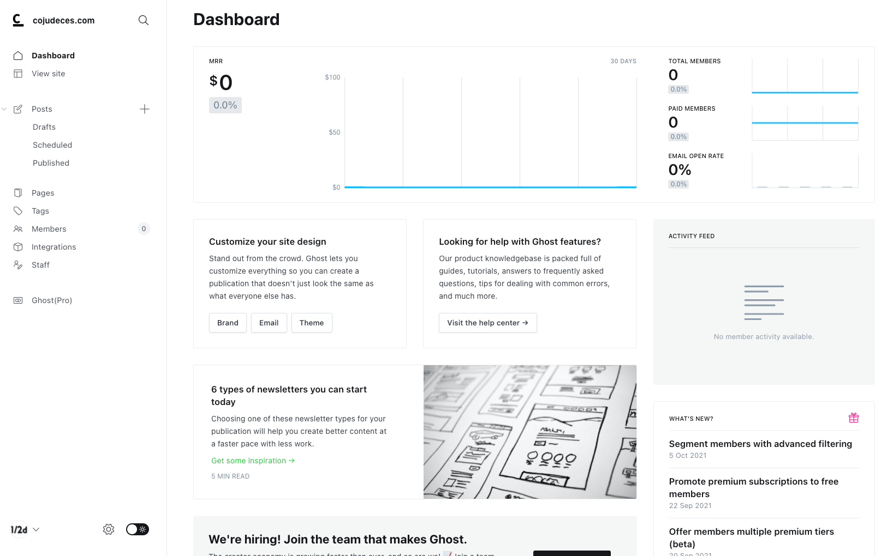
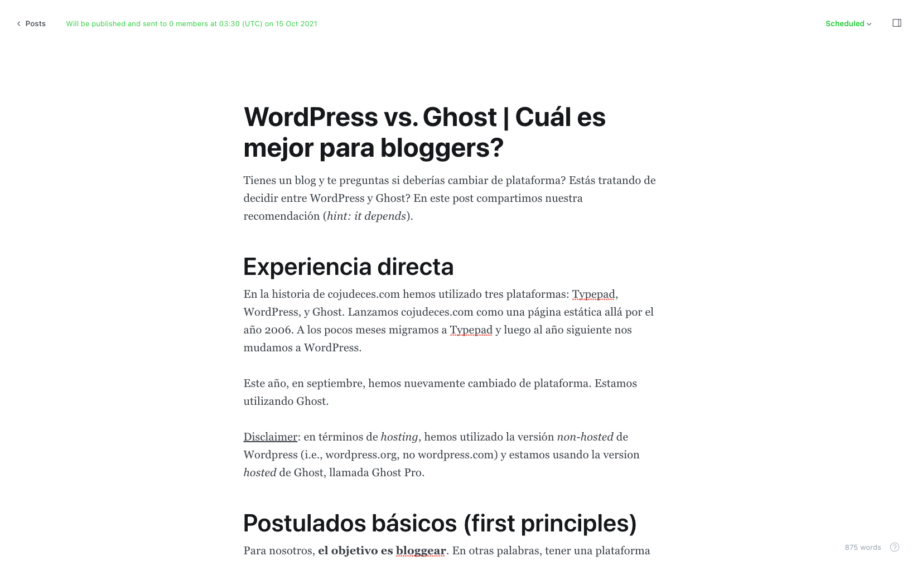
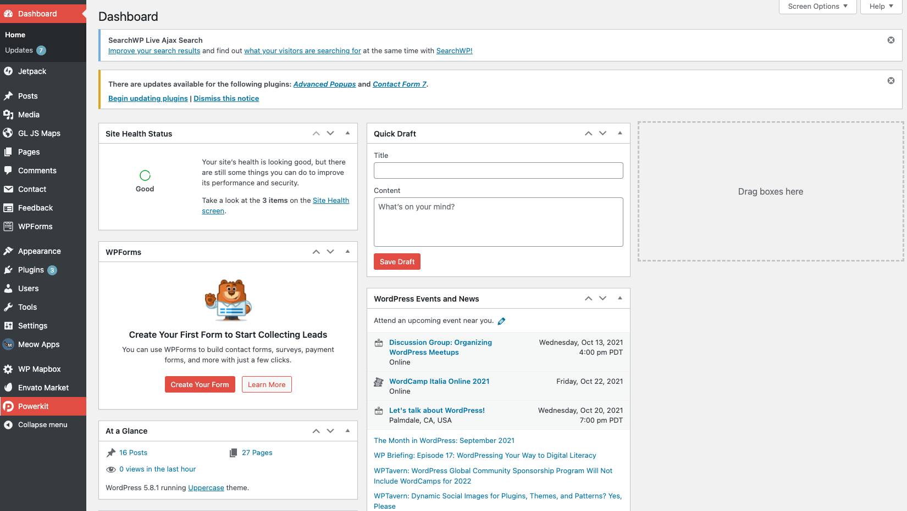
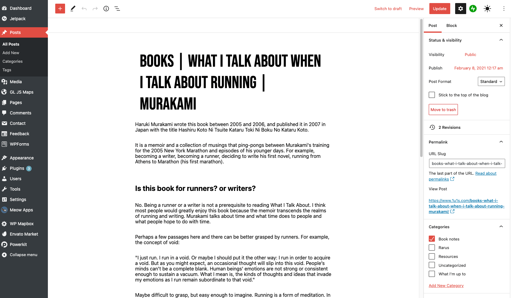

Tienes un blog y te preguntas si deberías cambiar de plataforma? Estás tratando de decidir entre WordPress y Ghost? En este post compartimos nuestra recomendación (_hint: it depends_).

# Experiencia directa

En la historia de cojudeces.com hemos utilizado tres plataformas: Typepad, WordPress, y Ghost. Lanzamos cojudeces.com como una página estática allá por el año 2006. A los pocos meses migramos a Typepad y luego al año siguiente nos mudamos a WordPress.

Este año, en septiembre, hemos nuevamente cambiado de plataforma. Estamos utilizando Ghost.

Disclaimer: en términos de _hosting_, hemos utilizado la versión _non-hosted_ de Wordpress (i.e., wordpress.org, no wordpress.com) y estamos usando la version _hosted_ de Ghost, llamada Ghost Pro.

# Postulados básicos (first principles)

Para nosotros, **el objetivo es bloggear**. En otras palabras, tener una plataforma para escribir y compartir nuestras cojudeces. Eso es todo. No queremos distracciones por más bienvenidas que sean, y tampoco queremos construir una tienda virtual y vender polos y tazas.

Por lo tanto, hemos identificado los siguientes postulados básicos para la selección de plataforma.

1. **Simplicidad**. Cada elemento de la plataforma debe cumplir una función que contribuye al objetivo de bloggear. No debe haber elementos que compliquen o que distraigan.
2. **Estética**. Va tanto para el _front end_ como el _back end_.  
    Back end: la interfaz debe ser limpia, intuitiva, minimalista, y de diseño moderno. Escribir un post tiene que dar gusto.  
    Front end: la plataforma debe contar con temas (_themes)_ limpios y minimalistas.
3. **Velocidad**. La velocidad de carga debe ser muy buena o excelente, tanto en un monitor como en un teléfono móvil.

# Simplicidad y estetica: dashboard y editor de posts

El dashboard e interfaz de usuario de Ghost es mucho más simple que el de Wordpress. La interfaz y editor de Ghost están diseñados con un solo objetivo principal: escribir y publicar posts. WordPress, por su parte, tiene un tablero con muchas más herramientas a la vista, con más "ruido".

Ese ruido de la interfaz de WordPress puede distraer (i.e., el post no llega a escribirse o toma cinco veces más tiempo de lo esperado) o, como mínimo, hace que la experiencia sea un poquito menos emocionante.

En la práctica, cuando usamos WordPress, escribimos nuestros posts en otra herramienta (Google Docs, Evernote, o Notion) y luego pegamos el contenido en el editor de WordPress. Cuando usamos Ghost, escribimos nuestros posts (como éste) con gusto directamente en el editor.

#### Ghost

#### Wordpress

**Ghost es el ganador** en este aspecto.

# Velocidad

Ghost afirma que la plataforma es 19 veces más rápida que WordPress ([ver aquí](https://ghost.org/vs/wordpress/?ref=cojudeces.com)) gracias a que usan tecnología más moderna basada en Node.js.

Muchos disputan esa afirmación de Ghost y dicen que, haciendo pruebas en el mundo real, ambas plataformas son comparables en el tema velocidad, sobre todo después de instalar plugins de optimización en WordPress. También hay quienes dicen que, si bien Ghost es súper rápido _out of the box_, la velocidad se degrada si uno hace cambios al código fuente o a los temas ([por ejemplo, aquí](https://jimmakos.com/2021/07/ghost-better-than-wordpress/?ref=cojudeces.com)).

Desde nuestro punto de vista, WordPress es una plataforma antigua, recargada de plugins y herramientas dispersas. El hecho de que los defensores de WordPress digan que "la velocidad es comparable a Ghost, tan sólo es cuestión de instalar un plugin adicional" dice mucho.

**Otro punto a favor de Ghost es que la navegación en el dashboard es instantánea**, mientras que en WordPress uno hace click en un menu... y tiene que esperar que cargue, hace click en una herramienta... y tiene que esperar que cargue...

Nota: nuestra comparación no es necesariamente imparcial, debido al tema hosting (ver el disclaimer en la primera sección).

**Ghost es el ganador** aquí también.

# Otros aspectos importantes

Los puntos mencionados arriba son específicos para lo que buscamos en cojudeces.com, sin embargo, hay otros aspectos que también son importantes.

## Facilidad para hacer cambios

Aquí el claro **ganador es WordPress**. Es muy fácil cambiar el diseño de las páginas y añadir funcionalidades extra. No se necesita saber programar.

Para hacer modificaciones en Ghost, por el momento, uno tiene que sentirse cómodo leyendo y escribiendo código.

## Comunidad y training

WordPress lleva casi dos décadas en el mundo, además se usa en un tercio de las páginas de internet. Su edad y diseminación hacen que existan infinitos recursos online en temas de educación, troubleshooting, adecuaciones específicas, etcétera.

Ghost es una plataforma más joven (establecida el 2013) que cuenta con una fracción del volumen de recursos de WordPress. Existen online forums y communities, pero aún hay preguntas por hacer y por responder. Ah, y hay que entender código para digerir mucha de la información de los forums.

## Escalabilidad

Ghost fue específicamente diseñado para blogs y publicaciones. Si bien la plataforma puede integrarse con una multitud de [servicios](https://ghost.org/integrations/?ref=cojudeces.com), al final de cuentas se mantiene fiel a su esencia.

Wordpress, en cambio, es una plataforma que puede modificarse para crear prácticamente cualquier tipo de website. Desde un simple blog hasta una tienda online.

# Conclusión

Si tu objetivo es solamente bloggear y te atrae la simplicidad y el minimalismo, utiliza Ghost. Si quieres crear un website más complejo (hoy o en el futuro) o si eres de aquellos que hacen modificaciones cada cierto tiempo y no te gusta la programación, entonces usa WordPress.
