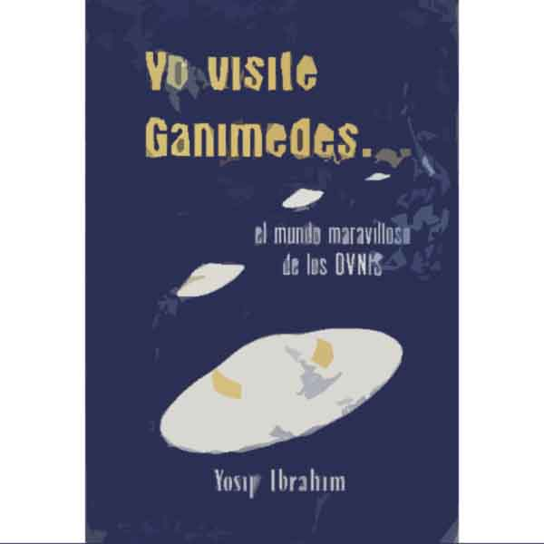

Esta mañana de jueves, estuvimos conversando con nuestro gran amigo y asesor J. Hablábamos de estupideces diversas, poker en la casa del terror, las figuras célebres que el colegio La Recoleta solía formar en el ayer y cómo el hoy es una espera ansiosa, una fútil e interminable adición de ceros (esta última frase copiada de [Waking Life](http://www.imdb.com/title/tt0243017/?ref=cojudeces.com), película de Richard Linklater). En fin, hablábamos de esas cosas.

Luego pasamos a hablar de literatura, J comentó que está leyendo un libro un poco cojudo pero cautivador. Compartió el inicio del libro con nosotros, y esa frase primera fue tan extraordinaria, que nos hizo recordar aquellos otros inicios que han quedado en la memoria:

> "The sea is high again today, with a thrilling flush of wind. In the midst of Winter you can feel the inventions of Spring." (Justine, de Lawrence Durrell).

> "Bastará decir que soy Juan Pablo Castel, el pintor que mató a María Iribarne" (El Túnel, de Ernesto Sabato).

> "Pues sí: soy huésped de un sanatorio. Mi enfermero me observa, casi no me quita la vista de encima; porque en la puerta hay una mirilla; y el ojo de mi enfermero es de ese color castaño que no puede penetrar en mí, de ojos azules." (El Tambor de Hojalata, de Günter Grass).

> "Hoy, mamá ha muerto. O tal vez ayer, no sé." (El Extranjero, de Albert Camus).

> "I saw the best minds of my generation destroyed by madness..." (Howl, Allen Ginsberg).

> "No he querido saber, pero he sabido..." (Corazón Tan Blanco, Javier Marías).

La maravillosa frase inicial que nuestro asesor Jashim compartió es la siguiente:

> **“Los habitantes del planeta Ganímedes mantienen contacto con los terrícolas, entre ellos ‘Pepe’.”**

Esta deliciosa frase es del libro titulado “Yo visité Ganímedes”, del peruano Yosip Ibrahim. J, esperamos tus comentarios cuando termines con el libro.
